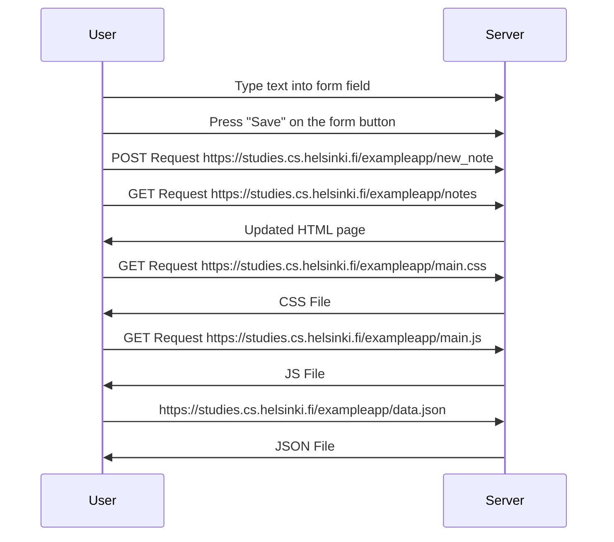

```mermaid
    sequenceDiagram
        participant User
        participant Server

        User->>Server: Type text into form field
        User->>Server: Press "Save" on the form button
        User->>Server: POST Request https://studies.cs.helsinki.fi/exampleapp/new_note
        User->>Server: GET Request https://studies.cs.helsinki.fi/exampleapp/notes
        Server->>User: Updated HTML page
        User->>Server: GET Request https://studies.cs.helsinki.fi/exampleapp/main.css
        Server->>User: CSS File
        User->>Server: GET Request https://studies.cs.helsinki.fi/exampleapp/main.js
        Server->>User: JS File
        User->>Server: https://studies.cs.helsinki.fi/exampleapp/data.json
        Server->>User: JSON File
```
