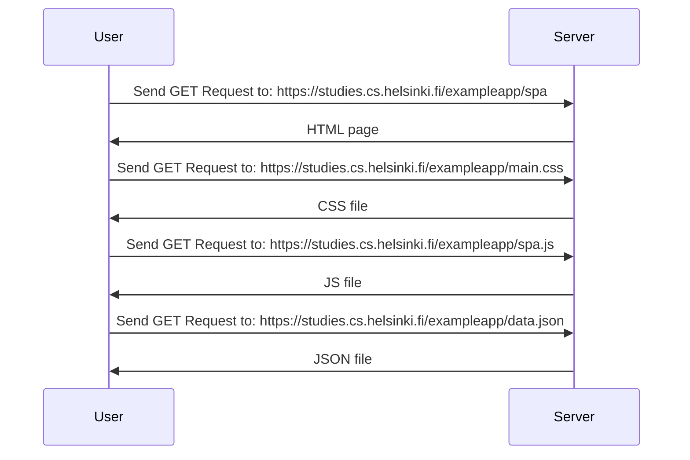

```mermaid
    sequenceDiagram
        participant User
        participant Server

        User->>Server: Send GET Request to: https://studies.cs.helsinki.fi/exampleapp/spa
        Server->>User: HTML page
        User->>Server: Send GET Request to: https://studies.cs.helsinki.fi/exampleapp/main.css
        Server->>User: CSS file
        User->>Server: Send GET Request to: https://studies.cs.helsinki.fi/exampleapp/spa.js
        Server->>User: JS file
        User->>Server: Send GET Request to: https://studies.cs.helsinki.fi/exampleapp/data.json
        Server->>User: JSON file
```
